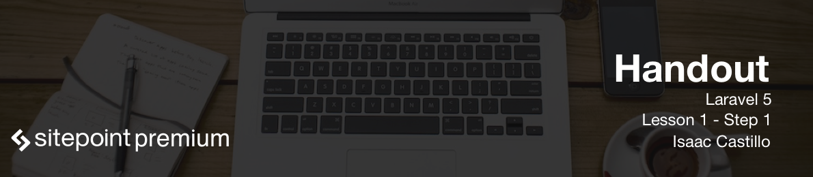

# What is Laravel and what does it do

Laravel is an MVC PHP framework that helps with rapid application development. It was created and maintained by Taylor Otwell.

It has become very popular and is holding a strong community around it.

Laravel gives you some great tools outside of the box. User authentication is an example of one if these tools that saves lots of time on development. Imagine creating a login form, creating a database for your user, hashing the password and creating the session state so you can have a logged in user. With Laravel you get that out of the box.

## Routing

Routing is an additional out of the box tool we get that allows us to have pretty urls for each part of the application that we want to expose. The following is a quick example.

```
Route::get('/users', 'UsersController@index');

# At the browser do the following
http://homestead.app/users
```

## Eloquent ORM

Eloquent ORM is another out of the box tool that gives us easy access to records in a database. So imagine we need to collect all the posts from a blog in a database. Normally, using ```PDO```, you would need a sql statement that would pull those records out in a usable format. See the following:

```
$stmt = $dbc->query('SELECT * FROM users');
$stmt->fetch(PDO::FETCH_ASSOC);
```

With Eloquent ORM you would do the following and have what you need.

```
$posts = Posts::all();
```

## Pagination

Pagination is another hard to solve problem that requires carrying state from page to page and some math along with querying the database for the records required for that page. With Laravel it is built out of the box for you.

```
$posts = Posts::paginate(4); // 4 records per page

// On the view you would just do

{{ $posts->links() }}
```

These are just a few of the many tools that we get with Laravel. The repetitive items that you would have to do with regular php applications have been made easier to overcome with these built in out of the box tools.