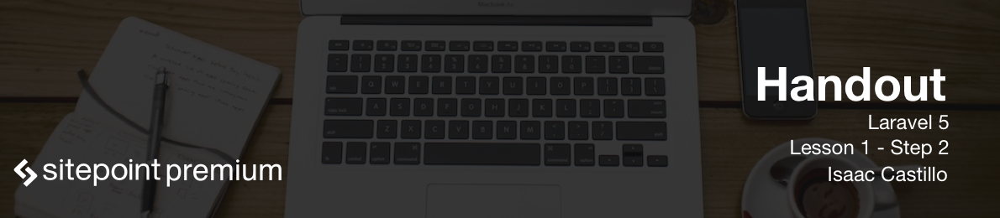

# Install Prerequisites for Laravel

The following are requirements for installing Laravel.

- PHP >= 5.5.9
- OpenSSL PHP Extension
- PDO PHP Extension
- Mbstring PHP Extension
- Tokenizer PHP Extension
- Composer

## Homestead

An easy way to make sure that all of these prerequisites are installed is to use Laravel's virtual machine called `Homestead`.

`Homestead` is a virtual machine that is used for easy development. Think of a virtual machine as a fake machine (computer) that is inside your current computer. There are several reasons you would want to use a virtual machine. One being we don't have to mess with any core files of our operating system and for any reason something is corrupt it would be easier just to destroy the box and bring it back up again.

Included software with the vm:

- Ubuntu 14.04
- Git
- PHP 7.0
- HHVM
- Nginx
- MySQL
- MariaDB
- Sqlite3
- Postgres
- Composer
- Node (With PM2, Bower, Grunt, and Gulp)
- Redis
- Memcached
- Beanstalkd

## Installing Homestead

First you need to install [Virtual Box](https://www.virtualbox.org/wiki/Downloads) which is a software that will run your virtual machines. Another tool you will need is called [Vagrant](http://www.vagrantup.com/downloads.html). Vagrant makes our VM configurable and distributable using a simple configuration file, and it can be used with Virtual Box, VMware, etc.

After you have Vagrant installed you can run the following:

```
vagrant box add laravel/homestead
```

Now clone the Homestead repo and run the bash install script.

```
cd ~
git clone https://github.com/laravel/homestead.git Homestead
cd Homestead/
bash init.sh
```

## Configure Homestead

The `bash init.sh` will load the ```~/.homestead/Homestead.yaml``` file for you. This file will be used to configure and install any additional apps that we can develop. The file looks something similar to below snippet. Every time we adjust this file for new applications we need to run ```vagrant reload``` from the ```~/Homestead``` directory.

```
ip: "192.168.10.10"

folders:
    - map: ~/projects # (Mac)
      to: /home/vagrant/projects # (Virtual Machine)
      type: "nfs"

sites:
    - map: homestead.app
      to: /home/vagrant/projects/homestead.app/public

databases:
    - homestead
```

## Hosts file

Next lets add a line to our ```/etc/hosts```. The hosts file is used to map hostnames to addresses. It is a way for us to use `homestead.app` and route that to the ip address of the homestead vm. ```192.168.10.10  homestead.app``` should be added your hosts file.

## Bringing up the virtual machine

Let's install and bring up the vagrant machine now. From the ```~/Homestead``` directory run ```vagrant up```. This will install all the included software listed above which should take a few minutes.

Now lets try to hit the url and see if everything installed correctly. Go to your browser and type in ```http://homestead.app```. You should see an nginx error. (checking to see if this is true)