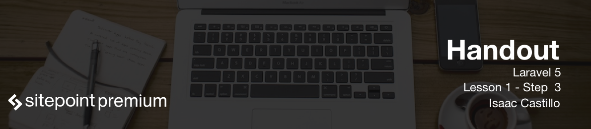

# Installing our first Laravel application

Install the Laravel installer with composer

```
composer global require "laravel/installer"
```

After that is installed lets make sure we tell our system to respond to our command.

```
~/.composer/vendor/bin // added to our path
```

## Install a new project

Now lets run the following to create a new Laravel install.

```
cd ~/projects
laravel new blog.app
```

Now we need to tell our vagrant machine that our new site needs to be available.

```
cd ~/.homestead
subl Homestead.yml
```
Add the following to the sites section

```
sites:
    - map: blog.app
      to: /home/vagrant/projects/blog.app/public

databases:
	- blog_db
```

Now run ```vagrant reload --provision``` to reload the virtual machine with the new site we added.

Next we will need to generate an application key for our site that is unique to that site.

```
cd ~/Homestead
vagrant ssh
cd /home/vagrant/projects/blog.app/public
php artisan key:generate
```

## Setting up our .env file

Our ```~/projects/blog.app/.env``` file is used to protect our information so we don't commit any private information about our database credentials to github. Plus others on your team may need different credentials to match for their local development. The ```~/projects/blog.app/.env``` file looks something like this:

```
APP_ENV=local
APP_KEY=SomeRandomString
APP_DEBUG=true
APP_LOG_LEVEL=debug
APP_URL=http://localhost

DB_CONNECTION=mysql
DB_HOST=127.0.0.1
DB_PORT=3306
DB_DATABASE=homestead
DB_USERNAME=homestead
DB_PASSWORD=secret

CACHE_DRIVER=file
SESSION_DRIVER=file
QUEUE_DRIVER=sync

REDIS_HOST=127.0.0.1
REDIS_PASSWORD=null
REDIS_PORT=6379

MAIL_DRIVER=smtp
MAIL_HOST=mailtrap.io
MAIL_PORT=2525
MAIL_USERNAME=null
MAIL_PASSWORD=null
MAIL_ENCRYPTION=null
```
Your key may be populated with random characters already from our previous command we ran.

We can also use out `Homestead.yaml` to add our environment variables to the server.

```
variables:
- key: DB_CONNECTION
value: mysql
- key: DB_HOST
value: 127.0.0.1
- key: DB_PORT
value: 3306
- key: DB_DATABASE
value: blog_db
- key: DB_USERNAME
value: homestead
- key: DB_PASSWORD
value: secret
```

We need to provision our VM again using the `vagrant reload --provision` command because we've updated the Homestead file.

## Setting up our DB

Change the following section change to the following:

```
DB_CONNECTION=mysql
DB_HOST=127.0.0.1
DB_PORT=3306
DB_DATABASE=blog_db
DB_USERNAME=homestead
DB_PASSWORD=secret
```

## Setting up our hosts file

Lets edit our hosts file so we can point our new app to the server.

```
subl /etc/hosts


// Add the line
192.168.10.10  blog.app
```
