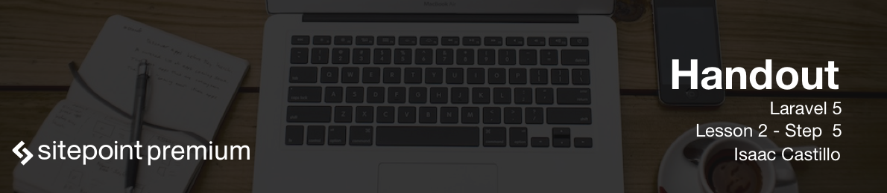

# The power behind blade templating

Blade is a template engine that comes with Laravel. All of the blade syntax gets compiled into php in the end. Blade syntax makes it easier for us to keep our html syntax clean and separated from any php code. So all of the following are done in the View "V" of the MVC framework.

## File extension

Like we discussed before when we return a view `view('posts');` the file can be either of two paths `resources/views/posts.php` or `resources/views/posts.blade.php`. To take advantage of blade syntax we need to make sure the file name ends in `.blade.php`. This will tell Laravel that we want to use blade syntax on the file.

## Main Layout

Usually I create a main layout file for all my applications. I then use or extend from this layout for all my pages. If for any reason I have something that is too different in structure I would then just create another layout for that need. Let's create `resources/views/layouts/master.blade.php` file. Here is where I start the main skeleton structure of the site layout. Since I will probably be using bootstrap I have a bootstrap starter template.

```
<!DOCTYPE html>
<html lang="en">
  <head>
    <meta charset="utf-8">
    <meta http-equiv="X-UA-Compatible" content="IE=edge">
    <meta name="viewport" content="width=device-width, initial-scale=1">
    <!-- The above 3 meta tags *must* come first in the head; any other head content must come *after* these tags -->
    <title>Blog title - @yield('title')</title>

    <!-- Latest compiled and minified CSS -->
	<link rel="stylesheet" href="https://maxcdn.bootstrapcdn.com/bootstrap/3.3.6/css/bootstrap.min.css" integrity="sha384-1q8mTJOASx8j1Au+a5WDVnPi2lkFfwwEAa8hDDdjZlpLegxhjVME1fgjWPGmkzs7" crossorigin="anonymous">

    <!-- HTML5 shim and Respond.js for IE8 support of HTML5 elements and media queries -->
    <!-- WARNING: Respond.js doesn't work if you view the page via file:// -->
    <!--[if lt IE 9]>
      <script src="https://oss.maxcdn.com/html5shiv/3.7.2/html5shiv.min.js"></script>
      <script src="https://oss.maxcdn.com/respond/1.4.2/respond.min.js"></script>
    <![endif]-->
  </head>
  <body>
    <h1>Title of page</h1>

    @section('sidebar')
    	Area for sidebar
    @show

    <main>
    	@yield('content')
    </main>

    <!-- jQuery (necessary for Bootstrap's JavaScript plugins) -->
    <script src="https://ajax.googleapis.com/ajax/libs/jquery/1.11.3/jquery.min.js"></script>
    <!-- Latest compiled and minified JavaScript -->
	<script src="https://maxcdn.bootstrapcdn.com/bootstrap/3.3.6/js/bootstrap.min.js" integrity="sha384-0mSbJDEHialfmuBBQP6A4Qrprq5OVfW37PRR3j5ELqxss1yVqOtnepnHVP9aJ7xS" crossorigin="anonymous"></script>
  </body>
</html>
```

When we return a view like before we do `return view('posts');` which means we should have file called `resources/views/posts.blade.php`. Here there is no need to redo the layout code again as we will be extending that code. This looks like the following:

```
@extends('layouts.master')

@section('title', 'Blog title here')

@section('sidebar)
	@parent

	<p>We still have parents content now we are appending to it.</p>
@endsection

@section('content')
	<p>This will get placed where our yield content is.</p>
@endsection
```

### @yield

Looking at the above we are saying we want to extend master template that is in the layouts folder. `layouts.master` is the same as saying we want to use the html from `layouts/master.blade.php`. When we see the `@yield('title')` in the main layout we can place content there by doing the `@section('title', 'Blog title')`.

### @parent

The `@parent` is saying to allow the parent content here and then append whatever we add to it.

### @section

The `@section('content')` along with the `@endsection` enclose content that will be placed where the `yield('content')` area would be in the `master.blade.php` file.

### @include

This include works the exact same as our regular include inside of php. Sometimes we break away chunks of the main layout that we want included in other layouts. So we don't duplicate code `@include` is a great way to achieve this.

## Showing data

So normally in php files we would do `<?php echo $some_variable ?>`. Lets say that this was data coming from the database and someone entered in html to attack our our site then we would do `<?php echo htmlentities('$some_variable'); ?>`. With blade syntax we can do the same like so `{{ $some_variable }}` and that is all we need. If you're using a front-end framework like VueJS you can ignore it `@{{ var }}`. Another cool thing to do is for some reason what if you wanted to check the value if it exists and if not display other data. Blade syntax gives us `{{ $some_variable or 'Us this instead' }}`. Saying if `$some_variable` does not exist then use the default string we pass it.

## Control structures

### If/elseif/else

In php sometimes we need to wrap our views in conditionals so that we can show or not show any conetnt that we would like. We do so with `if` and `if else` statements. Blade helps us clean up this syntax a little bit too. See the differences between the two.

```
<?php if(condition) { ?>
		// ... do HTML code
<?php	} else {
		// ... else HTML code
<?php } ?>
```

__Blade Syntax__

```
@if(condition)
	// ... do HTML code
@else
	// ... do HTML code
@endif
```

### Looping

Every loop available to us in php are also available in blade syntax. See the following ways to loop.

A for loop can be written like this.

```
@for ($i = 0; $i < 10; $i++)
    The value is: {{ $i }}
@endfor
```

If we need to loop through data provided that we have an array we can use a foreach directive.

```
@foreach ($posts as $post)
    <h1>{{ $post->title }}</h1>
@endforeach
```

Then we can do a while loop like the following.

```
@while (condition)
    // ... do code
@endwhile
```