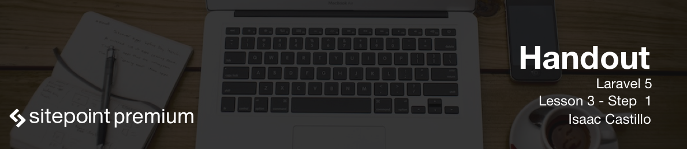

# Laravel File Structure

It is important to understand what goes where when interacting with your application. We will go through the Laravel structure to explain the folders we will be interacting with the most.

## app/

Our app directory is the folder we will probably spend most of our time in. In the app root directory is where our models live. You can already see we have a model called `User.php`.

### app/Http/

Our `Http` has the `Controllers, Middleware, Requests, routes.php` inside of it. `Controllers` folder is where all of our controllers will go. `Middleware` as we discussed before when generated will be placed in this folder. `Requests` folder will also have files generated that will go in there. We will be placing any form validation rules inside of here. The magical `routes.php` file that controls all the traffic that comes from the browser lives inside of here.

## config/

Our config folder holds all configuration files that interact with our application. We have our database configs here. There are some default configs for our application. If we are going to interact with a 3rd party application that requires configuration more than likely the configuration for that will go in this folder.

## database/

Our database migrations and seeders will go in this folder. A database migration is a set of rules that run at the command line and create our database structure. Seeders are a set of data that either we loop through or provide so our application has a base set of data to start with or test with.

## public/

The public folder is the front facing folder that the browser will see when the site is visited. Here is where the system will place your asset (css, images and script) files. A good structure you could use could be like the following:

```
public
	- assets
		- css
		- img
		- js
```
But this structure is entirely up to how you want to manage your assets.

## resources/

The resources folder is where we work with our assets and in the end they get compiled and placed where they are needed in our `public/` folder. They are compiled with Laravel and also our `gulpfile.js`. `resources/assets` is where we place asset files `js, img, css and/or sass/less` files. We have a `lang` file where we would put any localization language files. We have our `views` folder where will be placing all of our html files and also where our blade templating will go. The structure looks like this.

```
resources
	- assets
		- js
		- sass/less
		- img
	- lang
	- views
```

## tests/

The tests folder holds our applications test cases.

## gulpfile.js

Laravel wraps the gulpfile.js with it's own library called `Elixir`. This setup gives us what is a called an asset pipeline. We edit this file to tell our application how to manage our assets.
