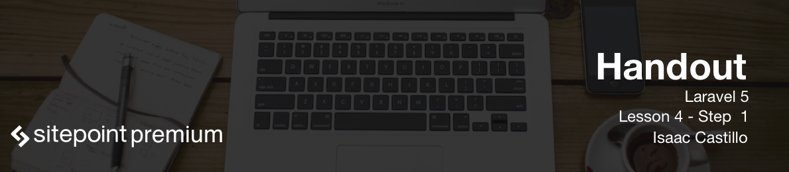

# Running our first migrations

One of the things we will be doing for our application is creating our own migration files. Migrations help us create and version our own database structure through files. The power behind doing migration files is that we can create databases with one command and if need be we can delete them all and bring them back up again with a few commands.

## Setting up Sequel Pro

[Sequel Pro](http://www.sequelpro.com/) is a nice free tool that allows us to view our mysql databases. They do have a donate button that helps support the development for this project. We can use this tool with the setup below to see any changes that we make in our database.


## Create a Migration

First we run the migration and pass a name to it which will create our migration file. We can pass what we call a flag with `--create=posts` which gives additional instructions to our migration file. In this case we get extra code in our file so we don't have to go searching for what we need.

```php artisan make:migration create_posts_table --create=posts```

This created a file for us with the following content:

```php
<?php

use Illuminate\Database\Schema\Blueprint;
use Illuminate\Database\Migrations\Migration;

class CreatePostsTable extends Migration
{
    /**
     * Run the migrations.
     *
     * @return void
     */
    public function up()
    {
        Schema::create('posts', function (Blueprint $table) {
            $table->increments('id');
            $table->timestamps();
        });
    }

    /**
     * Reverse the migrations.
     *
     * @return void
     */
    public function down()
    {
        Schema::drop('posts');
    }
}
```
We have an up() method and a down() method. The up() method is where we put the code that will create our database. The current one will only create an id that increments and two timestamp fields. `created_at` and `updated_at` that will be kept up to date by Laravel. Some additional code before we run the migration for our blog posts could be the following.

```
public function up()
{
    Schema::create('posts', function (Blueprint $table) {
        $table->increments('id');
        $table->string('title', 100);
        $table->text('body');
        $table->timestamps();
    });
}
```
What we are saying is create a varchar with the name title and then we add a text field with the name body.

You will also notice the `down()` method has `Schema::drop('posts');` this will give us exactly what we need to delete the database so we can restart our database structure.

## Running Our Migration

To run our migration we have to do so from the virtual machine. We would run the following.

*Note*: (If you did take my suggestion you can use `homestead ssh`)
```
cd ~/Homestead
vagrant ssh
cd ~/Code
php artisan migrate:install
php artisan migrate
```

If we connect to our sequel pro you will see a new table called migrations. This table will keep track of all our migrations when we refresh or reset our databases.

The first command will install the migrations table and the second command will install the table `posts` with the tables.

- id
- title
- body
- created_at
- updated_at

You may also see a table users there. This is a migration that comes preinstalled with Laravel install. This is because we get authentication out of the box.
