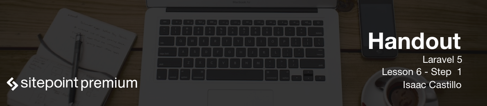

# Setting up our first controllers

Controllers are the "C" in "MVC" framework. These files hold of alot of the glue that ties our application together. We should be routing to these controllers then our controllers connect to the model and send that data to our view.

## Creating a controller

To create a controller you guessed it we are going to be using an artisan command to do so. Inside our virtual machine we would run `php artisan make:controller PostsController --resource`. This will create a boilerplate controller file that comes along with methods that we can easily tie our routes file to.

```
<?php

namespace App\Http\Controllers;

use Illuminate\Http\Request;

use App\Http\Requests;

class PostsController extends Controller
{
    /**
     * Display a listing of the resource.
     *
     * @return \Illuminate\Http\Response
     */
    public function index()
    {
        //
    }

    /**
     * Show the form for creating a new resource.
     *
     * @return \Illuminate\Http\Response
     */
    public function create()
    {
        //
    }

    /**
     * Store a newly created resource in storage.
     *
     * @param  \Illuminate\Http\Request  $request
     * @return \Illuminate\Http\Response
     */
    public function store(Request $request)
    {
        //
    }

    /**
     * Display the specified resource.
     *
     * @param  int  $id
     * @return \Illuminate\Http\Response
     */
    public function show($id)
    {
        //
    }

    /**
     * Show the form for editing the specified resource.
     *
     * @param  int  $id
     * @return \Illuminate\Http\Response
     */
    public function edit($id)
    {
        //
    }

    /**
     * Update the specified resource in storage.
     *
     * @param  \Illuminate\Http\Request  $request
     * @param  int  $id
     * @return \Illuminate\Http\Response
     */
    public function update(Request $request, $id)
    {
        //
    }

    /**
     * Remove the specified resource from storage.
     *
     * @param  int  $id
     * @return \Illuminate\Http\Response
     */
    public function destroy($id)
    {
        //
    }
}
```

Above is the file that was created by our command. Notice the empty methods that we need to fill in. By passing `--resource` to the command we told Laravel that we need resource controller. A resource controller is what is setup with the basic crud features that we would need.

__index()__ - should show all posts.

__create()__ - show a form to create a post.

__store()__ - handle the form after submission then save new post.

__show()__ - show a single blog post by passing an id param to this method.

__edit()__ - show a form to edit a post. Most likely will have form fields prefilled.

__update()__ - handle the edit form for updating.

__destroy()__ - handle the deletion of a post.

Also note that there is no code in either of the methods. We have to add the functionality that creates, updates or deletes a posts inside of these methods.

## Routing

To take full advantage of what Laravel has to offer we need to route to this controller. Before we just added code in our routes file and it seemed to work but for something more complex we should be routing to our `PostsController` file.

We can add to the following in our routes file. `Route::resource('posts', 'PostsController');`. This will add 7 routes to our routes:list so we are able to interact with our controller.

**Adding the routes separately before using resource routing will make things easier to understand**
