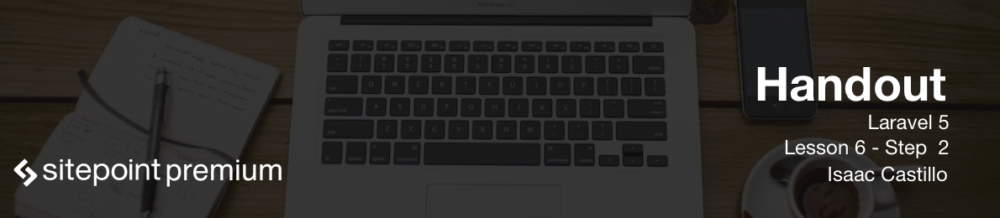

# Sending data to our views

We have already created our posts controller and have now mapped our route file to that. Now all we have left to do is pull the data from our database and then pass that to our view.

At the top of our controller we need to make sure we map our data file inside of this controller file. We would do so like `use App\Post;`

## index()

The index method should return all posts to the view. Below is how we would achieve that.

```
public function index()
{
	$posts = Post::all();
	return view('posts.index', ['posts' => $posts]);
}
```
**It's considered as a bad practice to dump all data (posts) at once, you should consider using pagination**

We are saying to find all the posts and hold them behind a variable `$posts`. After that we say to return a view with the view function available to us. The view function accepts a second parameter in an array format. The key of this array is what becomes available to us in the views. To test this out lets create a view in `resources/views/posts/index.blade.php`. The posts folder will not be there so you will need to create it.

Inside of this file just do `<?php dd($posts); ?>`. The `dd()` function tells Laravel to dump data and then die. This function is the best way to test and dump data. Now go to `http://blog.app/posts` to view our handy work.

## show()

The show method is a way that we can show a single blog post.

```
public function show($id)
{
	$post = Post::find($id);
	return view('posts.show', ['post' => $post]);
}
```

We tell Laravel to find one blog post by passing it an id. Remember in routing when we were able to pass a parameter to the url path? When we did Route::resource this route got created with a parameter passed as id in the url. Then we return the view and pass the data that pulled. Again we can create the view for this by adding the following `resources/views/posts/show.blade.php`. In this file you can do `dd($post)`. Notice in each method the difference between singular and plural. We can check this by going to `http://blog.app/posts/1`. The `1` being passed is passed to the show method as `id=1` for our app.

## create()

The create method is what holds our form for creating a post. To protect our application from cross-site request forgery we use the `csrf_field` function, which will insert a hidden input containing a CSRF token, and on form submit the `VerifyCsrfToken` is automatically called. You can see it inside the `app\Http\Kernel.php` file under the `$middlewareGroups` array. The other thing you will notice here is the action helper. This helper creates a url that directs us to the store method in the posts controller. Now visit `http://blog.app/posts/create` to see the form.

```
public function create()
{
	return view('posts.create');
}
```

### Our view

Created in `resources/views/posts/create.blade.php`.

```
<form method="POST" action="{{ action('PostsController@store') }}">
	{{ csrf_field() }}
	<input type="text" name="title">
	<textarea name="body"></textarea>
	<button>Send</button>
</form>
```

## store()

Inside the store method is where we want to handle the creation of a new record.

```
public function store(Request $request)
{
	$post = new Post;
	$post->title = $request->input('title');
	$post->body = $request->input('body');
	$post->save();

    // Should do something here, like returning to the posts listing!
}
```

## edit()

The edit method need to first find the record and then pass it to the form. We then send this form to the update method. We visit `http://blog.app/posts/1/edit` to see this method.

```
public function edit($id)
{
	$post = Post::find($id);
	return view('posts.edit', ['post' => $post]);
}
```

### Edit form

Our form is placed in the file `resources/views/posts/edit.blade.php`. The difference here from our create form is we have an added form field that is hidden that tells Laravel we need the Http verb PUT so it can pass to the update() method as opposed to the store() method. Another thing you will notice is the values we pass are pulled from the database. Also we changed our action and passed a second parameter of the id. This will help pass along the correct id that our update methods needs.

```
<form method="POST" action="{{ action('PostsController@update', $post->id) }}">
    <input type="hidden" name="_method" value="PUT">
    {{ csrf_field() }}
    <input type="text" name="title" value="{{ $post->title }}">
    <textarea name="body">{{ $post->body }}</textarea>
    <button>Send</button>
</form>
```

## update()

Our update is very similar to our store method except we have to find the post and then change the contents of it.

```
public function update(Request $request, $id)
{
	$post = Post::find($id);
	$post->title = $request->input('title');
	$post->body = $request->input('body');
	$post->save();
}
```

## destroy()

To pass a deletion of a posts we need to do so from a form in another view. For now I will put the button in the show page. In the `resources/views/posts/show.blade.php` file we will add the form that deletes.

```
<form method="POST" action="{{ action('PostsController@destroy', $post->id) }}">
    <input type="hidden" name="_method" value="DELETE">
    {{ csrf_field() }}
    <button>Delete Post</button>
</form>
```

Now in our destroy method we have to find the id of the post passed and delete it.

```
public function destroy($id)
{
	$post = Post::find($id);
	$post->delete();
}
```
