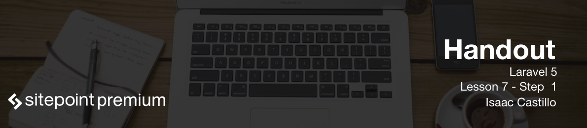

# Setting up our layouts

For our layout we will create a folder in `resources/views/layouts/master.blade.php`. I use this one file to control the look and feel of our app. If we need a different type layout then  I can create another layout file. The layout file is nothing more than just a blade template file that we will extend in the other views we created.

```
<!DOCTYPE html>
<html lang="en">
  <head>
    <meta charset="utf-8">
    <meta http-equiv="X-UA-Compatible" content="IE=edge">
    <meta name="viewport" content="width=device-width, initial-scale=1">
    <!-- The above 3 meta tags *must* come first in the head; any other head content must come *after* these tags -->
    <title>Blog title - @yield('title')</title>

    <!-- Latest compiled and minified CSS -->
    <link rel="stylesheet" href="https://maxcdn.bootstrapcdn.com/bootstrap/3.3.6/css/bootstrap.min.css" integrity="sha384-1q8mTJOASx8j1Au+a5WDVnPi2lkFfwwEAa8hDDdjZlpLegxhjVME1fgjWPGmkzs7" crossorigin="anonymous">

    <!-- HTML5 shim and Respond.js for IE8 support of HTML5 elements and media queries -->
    <!-- WARNING: Respond.js doesn't work if you view the page via file:// -->
    <!--[if lt IE 9]>
      <script src="https://oss.maxcdn.com/html5shiv/3.7.2/html5shiv.min.js"></script>
      <script src="https://oss.maxcdn.com/respond/1.4.2/respond.min.js"></script>
    <![endif]-->
  </head>
  <body>

    <nav class="navbar navbar-default">
      <div class="container-fluid">
        <!-- Brand and toggle get grouped for better mobile display -->
        <div class="navbar-header">
          <button type="button" class="navbar-toggle collapsed" data-toggle="collapse" data-target="#bs-example-navbar-collapse-1" aria-expanded="false">
            <span class="sr-only">Toggle navigation</span>
            <span class="icon-bar"></span>
            <span class="icon-bar"></span>
            <span class="icon-bar"></span>
          </button>
          <a class="navbar-brand" href="#">Blog</a>
        </div>

        <!-- Collect the nav links, forms, and other content for toggling -->
        <div class="collapse navbar-collapse" id="bs-example-navbar-collapse-1">
          <ul class="nav navbar-nav">
            <li class="active"><a href="#">Link <span class="sr-only">(current)</span></a></li>
            <li><a href="#">Link</a></li>
          </ul>
        </div><!-- /.navbar-collapse -->
      </div><!-- /.container-fluid -->
    </nav>
    <h1>@yield('title')</h1>

    <main class="container">
        @yield('content')
    </main>

    <!-- jQuery (necessary for Bootstrap's JavaScript plugins) -->
    <script src="https://ajax.googleapis.com/ajax/libs/jquery/1.11.3/jquery.min.js"></script>
    <!-- Latest compiled and minified JavaScript -->
    <script src="https://maxcdn.bootstrapcdn.com/bootstrap/3.3.6/js/bootstrap.min.js" integrity="sha384-0mSbJDEHialfmuBBQP6A4Qrprq5OVfW37PRR3j5ELqxss1yVqOtnepnHVP9aJ7xS" crossorigin="anonymous"></script>
  </body>
</html>
```

## index.blade.php

Now in our `index.blade.php` file we will extend the master layout and flesh out the blog posts a little more. Here we are printing out and looping through our blog posts. We also use the action helper to pass our action we want to go to and the id for that url. Laravel will take care of the rest and create a nice url for us to go to the single blog post.

```
@extends('layouts.master')

@section('content')
    @foreach($posts as $post)
        <h2><a href="{{ action('PostsController@show', $post->id) }}">{{ $post->title }}</a></h2>
        <p>{{ $post->body }}</p>
        <hr>
    @endforeach
@endsection
```

## show.blade.php

At the show method we extend the master and wrap some html around the rest of our view.

```
@extends('layouts.master')

@section('content')

    <h1>{{ $post->title }}</h1>

    <p>{{ $post->body }}</p>

    <form method="POST" action="{{ action('PostsController@destroy', $post->id) }}">
        <input type="hidden" name="_method" value="DELETE">
        {{ csrf_field() }}
        <button>Delete Post</button>
    </form>
@endsection
```

## create.blade.php

We add some more bootstrap templating and now our blog is looking a little better.

```
@extends('layouts.master')

@section('content')
    <form method="POST" action="{{ action('PostsController@store') }}">
        {{ csrf_field() }}

        <div class="form-group">
            <label for="title" >Blog title</label>
            <input type="text" name="title" class="form-control" id="title" placeholder="Enter title">
        </div>

        <div class="form-group">
            <label for="body">Body</label>
            <textarea name="body" id="body" class="form-control" placeholder="Enter body for blog post"></textarea>
        </div>

        <button class="btn btn-primary">Send</button>
    </form>
@endsection
```

### edit.blade.php

Now our edit view with bootstrap templating wrapped around.

```
@extends('layouts.master')

@section('content')
    <form method="POST" action="{{ action('PostsController@update', $post->id) }}">
        {{ csrf_field() }}
        <input type="hidden" name="_method" value="PUT">

        <div class="form-group">
            <label for="title" >Blog title</label>
            <input type="text" name="title" class="form-control" id="title" placeholder="Enter title" value="{{ $post->title }}">
        </div>

        <div class="form-group">
            <label for="body">Body</label>
            <textarea name="body" id="body" class="form-control" placeholder="Enter body for blog post">{{ $post->body }}</textarea>
        </div>

        <button class="btn btn-primary">Send</button>
    </form>
@endsection
```
