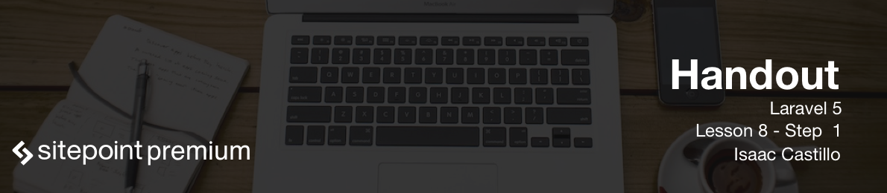

# The power behind Laravel and next steps

Laravel provides us with a bunch of boiler plate code that we use to do by hand over and over.  As you can see we didn't need much to have a simple crud operation for our blog example. With very little effort we were able to create 100 test blog posts and loop through them in our view. Then create a link over to the actual blog posts to show the individual posts.

## Just scratching the surface

What we did we are just scratching the surface of Laravel. We can easily add pagination to our blog posts or maybe we need to lock down the app and do some authentication.

## Next steps

Some next items to start looking into is for sure read through the [Laravel documentation](https://laravel.com/docs/5.2). We would need to add validation to our blog posts like imagine if we need to require a certain form field. What if we want to tie in authentication so we have to log in to provide blog post because we don't want just anyone blogging here. Then we need to make sure there is a relationship between the logged in user and a blog post. Next we may even want to clean up the look a little bit and show nice messages everytime there is new blog added or updated. Another thing to think about is deletion as you can see there was no warning message of "Are you sure you want to delete". This can be added and taken care of either Laravel or with javascript.

## Thank you

Thank you for watching this series and keep on hacking!